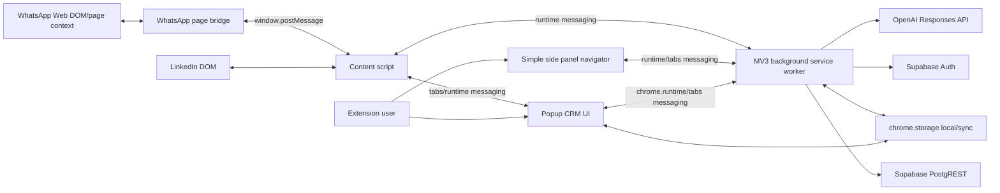
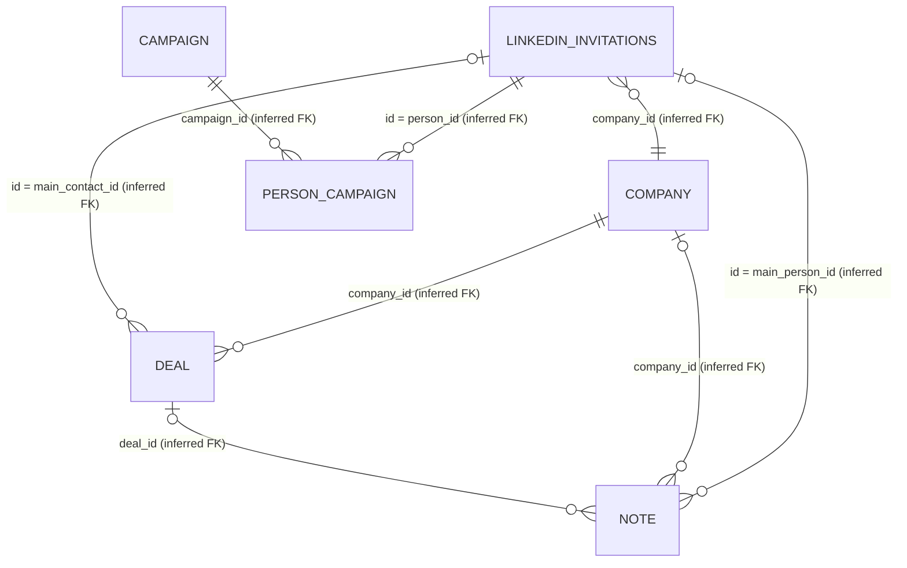

# Current System Handoff

Audit date: 2026-09-02  
Scope: read-only repository inspection plus an attempted read-only Supabase PostgREST OpenAPI request.  
Evidence notation: **Confirmed** means directly demonstrated by repository code/configuration. **Inferred** means an object or field is exercised by the client but its catalog definition was unavailable. **Unverified** means the live database catalog is required.

## 1. Executive summary

The product is a Chrome Manifest V3 extension named **LEF LinkedIn Invite Generator**. It extracts profile or company context from LinkedIn pages, uses OpenAI's Responses API to generate invitations, first messages, follow-ups, free-form text, and structured profile/company enrichment, and stores CRM records directly in Supabase through PostgREST. It also reads the currently open WhatsApp Web conversation through a page-context bridge and associates a phone-matched chat with a CRM contact. The popup has operational views for contacts, companies, campaigns, notes/tasks/meetings, deals, configuration, and Supabase email/password authentication. A separate, simpler side panel automates paced navigation through saved LinkedIn URLs.

There is no application server in the repository. The MV3 background service worker is the effective integration/backend layer, but it runs on the user's browser and calls OpenAI and Supabase directly. The OpenAI secret is supplied by the user and persisted in `chrome.storage.local`; the Supabase publishable key and project URL are compiled into client code. Supabase access uses a user JWT obtained through Supabase Auth. No service-role use was found.

The live Supabase schema could not be retrieved: the repository has no migrations or database connection string, no Supabase management connector is available in this session, and the safe PostgREST OpenAPI request to the configured project failed at the network layer. Accordingly, relation and column names below are exhaustively reported only to the extent proven by client REST calls. PostgreSQL types, nullability, defaults, keys beyond client conflict assumptions, constraints, indexes, RLS flags/policies, view SQL/security, database functions, and triggers are **not available** and are not invented.

The largest architectural review issue is authorization uncertainty. The client writes an authenticated user's ID into `linkedin_invitations.uuid`, but none of the other table writes visibly set an owner, and many updates filter only by record ID or LinkedIn URL. Secure isolation may exist in RLS, but it cannot be verified from this repository. Direct OpenAI calls and browser storage of a secret are also material risks.

## 2. Current workflows

### LinkedIn contact workflow

1. On `linkedin.com/in/*`, the content script scrapes name, headline, company and a bounded page excerpt using multiple DOM selectors (`src/content/content.js:59`, `src/content/content.js:69`, `src/content/content.js:79`, `src/content/content.js:108`).
2. The popup asks the content script for structured context and can inject it again when the content script is unavailable (`src/popup/profile-flow/profile-controller.js:122`, `src/popup/profile-flow/profile-controller.js:143`, `src/popup/profile-flow/profile-controller.js:223`).
3. The popup sends generation/extraction requests to the service worker; OpenAI calls occur there (`src/background/openai-service.js:180`, `src/background/openai-service.js:398`, `src/background/openai-service.js:534`).
4. The user reviews/copies generated text and records invitation state, acceptance, first-message state, contact details and message count in `linkedin_invitations` (`src/background/supabase-invitations.js:23`, `src/background/supabase-invitations.js:99`, `src/background/supabase-invitations.js:226`).
5. The contact can be linked to a company and campaigns and can receive notes or be selected as the main deal contact (`src/background/supabase-company.js:190`, `src/background/supabase-campaigns.js:148`, `src/background/supabase-deals.js:90`).

### Company workflow

Company and school pages are scraped by the same content script. OpenAI can convert raw page context into structured company fields. The worker searches, creates/merges by LinkedIn identifier, updates, archives, links people, and lists a company overview (`src/background/openai-service.js:462`, `src/background/supabase-company.js:231`, `src/background/supabase-company.js:302`, `src/background/supabase-company.js:408`).

### CRM workflow

The popup lists/searches contacts and companies through overview views; manages campaigns and memberships; creates/updates/archive-deletes notes; and creates/updates deals. The “todo” UI derives planned work from note dates/statuses and deals; no separate task table is referenced (`src/popup/todo/todo-controller.js:1`, `src/background/supabase-notes.js:68`, `src/background/supabase-deals.js:56`).

### WhatsApp workflow

The popup opens `https://web.whatsapp.com/send?phone=...` for a contact (`src/popup/list/company-controller.js:152`). On WhatsApp Web, the isolated content script injects the web-accessible `whatsapp-page-bridge.js` into page context. The bridge reads the selected conversation title and visible message/thread DOM and returns it through `window.postMessage`; the content script relays it to extension messaging/storage (`src/content/content.js:391`, `src/content/content.js:416`, `src/content/whatsapp-page-bridge.js:3`, `src/content/whatsapp-page-bridge.js:202`). The worker can match normalized phone numbers against `linkedin_invitations` (`src/background/background.js:656`, `src/background/background.js:712`). This is DOM extraction/navigation, not an official WhatsApp API integration, message sender, webhook, or persistent normalized message store.

### Authentication workflow

The configuration UI supports signup, email/password login, password recovery, and logout (`src/popup/list/auth-controller.js:107`, `src/popup/list/auth-controller.js:126`, `src/popup/list/auth-controller.js:191`). The worker calls Supabase Auth `/signup`, `/token?grant_type=password`, `/recover`, `/logout`, and `/user` endpoints (`src/background/supabase-service.js:61`, `src/background/supabase-service.js:150`, `src/background/supabase-service.js:197`, `src/background/supabase-service.js:236`).

## 3. Current architecture



### Runtime components and communication

- `manifest.json` selects `src/background/background.js` as the service worker, `src/popup/popup.html` as the action popup, and root `sidepanel.html` as the side panel.
- The service worker loads utilities, navigation, OpenAI, Supabase domain modules, and workflow code with `importScripts` (`src/background/background.js:1` through `src/background/background.js:35`). `background-main-01/02/03.js` appear to be split/refactor artifacts; the manifest does not load them.
- Popup code is plain ordered scripts, not ES modules or a framework (`src/popup/popup.html:1549` through `src/popup/popup.html:1584`). Controllers send typed `chrome.runtime` messages; the worker routes them and returns `{ok: ...}` results (`src/background/background.js:1000` onward).
- Content scripts are isolated-world DOM readers. WhatsApp additionally injects a page-world bridge because the required page state is not directly accessible from the isolated world.
- The side panel is a distinct lightweight URL queue/pacing UI, storing navigation state locally and driving tabs/content extraction (`sidepanel.js:180`, `sidepanel.js:345`, `sidepanel.js:351`, `sidepanel.js:406`). It is not the same document as the full CRM-like `src/popup/sidepanel.html`, which the manifest does not reference.

### Direct external calls

All discovered HTTP calls are in the worker layer:

- `POST https://api.openai.com/v1/responses` for generation and structured extraction/enrichment (`src/background/openai-service.js:180`, `src/background/openai-service.js:400`, `src/background/openai-service.js:464`, `src/background/openai-service.js:536`).
- Supabase Auth REST endpoints and `/rest/v1/*` PostgREST endpoints (`src/background/supabase-service.js`, all `src/background/supabase-*.js`).

No external application backend endpoint is called. The setting historically named `webhookBaseUrl` is treated as a Supabase URL override in the UI (`src/popup/config/config-controller.js:80`, `src/popup/config/config-controller.js:175`), while the current worker's `getSupabaseConfig()` returns its compiled default (`src/background/supabase-service.js:6`). This mismatch should be verified.

## 4. Repository structure

| Path | Role |
|---|---|
| `manifest.json` | MV3 metadata, permissions, entry points and site access. |
| `src/background/background.js` | Loaded service worker, message router and some duplicated legacy operations. |
| `src/background/openai-service.js` | OpenAI calls, retry/timeout, parsing and prompt orchestration. |
| `src/background/supabase-service.js` | Auth/session and Supabase request context. |
| `src/background/supabase-*.js` | REST adapters for contacts, companies, campaigns, prompts, notes, deals and overview views. |
| `src/background/navigation-watcher.js` | Tab/navigation observation for paced LinkedIn processing. |
| `src/content/content.js` | LinkedIn and WhatsApp isolated-world DOM extraction. |
| `src/content/whatsapp-page-bridge.js` | WhatsApp page-world DOM bridge. |
| `src/popup/popup.html`, `popup.css`, `popup.js` | Main UI and orchestration. |
| `src/popup/{core,config,list,messaging,profile-flow,notes,deals,todo}` | Popup controllers by concern. |
| `sidepanel.html`, `sidepanel.js` | Manifest-connected navigation side panel. |
| `src/popup/sidepanel.html` | Full popup HTML copy; not the manifest side-panel entry point. |
| `src/shared/*` | shared normalization, message types, status and storage keys. |
| `src/prompts.js` | prompt construction/templates. |
| `docs/engineering/*` | intended architecture, UI, security, conventions and refactor notes. |
| `src.zip` | committed source archive; provenance/release purpose unclear. |

There are no tests, `package.json`, build configuration, bundler, Supabase CLI folder, migrations, Docker files, or release scripts. `package-lock.json` contains no packages. The apparent build/deployment process is to load/package the source tree as an unpacked Chrome extension; exact Chrome Web Store/release steps are not documented.

## 5. Technology stack

- Chrome Extension Manifest V3, service worker, content scripts, popup, side panel.
- Plain HTML, CSS, and JavaScript; no runtime npm dependencies.
- Chrome APIs: tabs, webNavigation, scripting, storage, clipboard, runtime messaging, side panel.
- OpenAI Responses API, default model configured in UI as `gpt-4.1` (`src/popup/config/config-controller.js:149`).
- Supabase Auth and PostgREST called with `fetch`; no Supabase JS SDK.
- LinkedIn and WhatsApp Web DOM integrations.

## 6. Complete database model available from repository evidence

### Important limitation

No complete schema can factually be produced from this checkout. There are no SQL migrations. The live PostgREST OpenAPI metadata request failed before receiving an HTTP response. The following is the **complete set of application relations and fields found in repository REST code**, not a PostgreSQL catalog export. Unless stated otherwise, SQL data type, nullable flag, default, PK, FK, unique/check constraints, indexes, RLS state/policies, triggers, and ownership columns are **unverified**.

Client behavior provides only these limited structural clues: fields passed through `Number()` are likely numeric; boolean values are sent for `accepted` and some `archived` fields; ISO strings are sent for timestamps; `linkedin_url` is used as an upsert conflict target and is therefore expected to have a usable unique/exclusion constraint; identifiers are treated opaquely as strings.

### `public.linkedin_invitations` (inferred schema)

Purpose: principal person/contact and LinkedIn lifecycle record.

| Field referenced | Client evidence / likely meaning |
|---|---|
| `id` | Contact identifier; used as `person_id` by campaign/note/deal UI. PK status/type unverified. |
| `linkedin_url` | Canonical LinkedIn profile URL; upsert `on_conflict` target, so uniqueness is strongly inferred. |
| `uuid` | Set to authenticated Supabase user ID on selected upserts; ownership semantics strongly inferred but name is nonstandard. |
| `full_name`, `headline`, `company`, `language`, `comments`, `phone`, `email` | Contact/profile attributes. |
| `company_id` | Link to `company.company_id` inferred from application behavior. |
| `status` | Values seen include registered/generated, invited, accepted, first message sent, message responded. |
| `message`, `generated_at`, `invited_at` | Invitation text and lifecycle timestamps. |
| `accepted`, `accepted_at` | Boolean-like acceptance flag and timestamp. |
| `first_message`, `first_message_generated_at`, `first_message_sent_at` | First-message text/lifecycle. |
| `message_count` | Numeric counter updated by read-then-patch. |
| `campaign` | Legacy/singular campaign field still selected; normalized campaigns also use join table. |
| `archived` | Archive flag exposed through overview/application updates. |

Usage: `src/background/supabase-invitations.js`, `src/background/supabase-company.js:201`, `src/background/background.js:656`. Exact nullability/defaults and constraints other than the conflict inference are unverified.

### `public.company` (inferred schema)

Purpose: company master linked to contacts and deals.

Referenced fields: `company_id`, `linkedin_id`, `company_name`, `employee_number`, `company_size`, `it_members`, `sector`, `city`, `archived`. `linkedin_id` is the upsert conflict target and thus expected to be unique-compatible. `archived` is compared both to numeric `0` and written as a boolean-like value, so its true SQL type must be checked. Usage: `src/background/supabase-company.js:63`, `:89`, `:124`, `:159`, `:302`, `:448`.

### `public.deal` (inferred schema)

Purpose: opportunity attached to a company with an optional main contact.

Referenced fields: `deal_id`, `created_at`, `deal_name`, `deal_description`, `deal_value` (numeric input), `company_id`, `main_contact_id`, `deal_phase`. Application validation requires company, name and phase on create/update; this does **not** prove database `NOT NULL` constraints. Relationships inferred: `company_id -> company.company_id`; `main_contact_id -> linkedin_invitations.id`. Usage: `src/background/supabase-deals.js:56` through `:174`.

### `public.note` (inferred schema)

Purpose: notes, meetings and planned follow-up records.

Referenced/written fields: `note_id`, `note_title`, `note_description`, `created_at`, `status`, `date`, `notes_type`, `duration`, `archived`, `main_person_id`, `company_id`, `deal_id`. Creation adds only nonempty relationship IDs; update deliberately excludes relationship fields (`src/background/supabase-notes.js:54`, `:58`, `:68`, `:123`, `:154`). Likely relationships to contact, company, and deal are inferred, not catalog-confirmed.

### `public.campaign` (inferred schema)

Purpose: contact segmentation/campaign master.

Referenced fields: `campaign_id`, `campaign_name`, `color`, `archived`. New records set name/color; archive writes `archived: true` (`src/background/supabase-campaigns.js:15`, `:46`, `:70`, `:113`).

### `public.person_campaign` (inferred schema)

Purpose: many-to-many membership between the principal contact record and campaigns.

Referenced fields: `person_id`, `campaign_id`. The client prevents duplicates by querying both fields before insert but does not use `on_conflict`; a composite unique constraint is desirable but unverified. Relationships inferred: `person_id -> linkedin_invitations.id`, `campaign_id -> campaign.campaign_id` (`src/background/supabase-campaigns.js:148`, `:191`, `:245`).

### `public.prompt` (inferred schema)

Purpose: shared or user-scoped reusable prompts.

Referenced fields: `prompt_id`, `prompt_name`, `prompt_text`. No ownership field is sent or selected by the client (`src/background/supabase-prompts.js:15`, `:44`, `:80`, `:122`).

### Views (inferred result shapes; definitions unavailable)

| View | Fields selected by client | Inferred sources/purpose | Filters/order used | Security |
|---|---|---|---|---|
| `notes_view` | `note_id,note_title,note_description,created_at,status,date,notes_type,duration,person_name,company_name,deal_name,deal_description,archived,main_person_id,company_id,deal_id` | Likely `note` enriched from contact/company/deal; powers note/todo UI. | Person and/or company, archived; order is constructed in notes adapter. | Invoker/definer unverified. |
| `vw_deals_overview` | `deal_id,created_at,deal_name,deal_description,deal_value,company_id,company_name,main_contact_id,person_id,person_name,person_linkedin_url,deal_phase` | Likely `deal` joined to company and principal contact; all-deals UI. | `created_at desc`. | Unverified. |
| `vw_company_overview` | `company_id,company_name,linkedin_id,archived,employee_number,company_size,linked_person_count,customer_potential_score,sector,campaigns` | Likely company plus contact counts/campaign aggregation and calculated potential score. | Search/filter/pagination and sortable overview fields. | Unverified. |
| `vw_linkedin_invitations_overview` | `url,name,company,headline,most_relevant_date,archived,campaigns,status,accepted` | Likely contact plus campaign aggregation and calculated most-relevant date; contact grid. | Pagination; search name/company; campaign/status/archive/accepted filters; configurable order. | Unverified. |

There is no repository evidence of another application-owned table or view. This statement is limited to code/migrations: undisclosed live relations may exist.

### Functions, triggers and SQL definitions

No SQL files, RPC calls (`/rest/v1/rpc/*`), function definitions, trigger definitions, or webhook definitions were found. Therefore application-owned database functions and triggers are **unverified**, not confirmed absent. View SQL definitions and their invoker/definer configuration are unavailable. No SQL definitions can safely be included.

### Entity relationship diagram (inferred relationships)



## 7. Authentication and RLS

- Users authenticate directly against Supabase Auth with email/password; signup adds a `name` value to user metadata (`src/background/supabase-service.js:150`, `:197`).
- The full normalized access token, refresh token, expiry, and user object are stored in `chrome.storage.local` under `lef_supabase_session_v1` (`src/background/background.js:204`, `src/background/supabase-service.js:14`, `:34`, `:44`).
- The worker refreshes 45 seconds before expiry via the refresh-token grant and clears invalid sessions (`src/background/supabase-service.js:54`, `:83`, `:119`).
- Every database request uses the compiled publishable key plus `Authorization: Bearer <user JWT>`.
- `linkedin_invitations.uuid` is populated with `session.user.id` on upsert/status-only writes (`src/background/supabase-invitations.js:21`, `:153`). The client does not add an owner predicate to reads/patches; it depends entirely on RLS.
- No `user_id`, `organization_id`, or `tenant_id` field is referenced in application-owned relations. `uuid` is the only equivalent ownership field found and only on `linkedin_invitations`.
- `company`, `deal`, `note`, `campaign`, `person_campaign`, and `prompt` writes do not carry an owner field in client code. They may be globally shared, ownership may be injected by database defaults/triggers, or RLS may derive access through joins. This is **unverified and high priority**.
- Multiple Supabase Auth accounts are supported by the login UI, but safe multi-user record isolation is unverified. No organization/tenant selection or membership model appears in code.
- No service-role key or service-role HTTP usage was found. The embedded key is a publishable/anonymous client key, which is expected to be public; its safety still depends on grants and RLS.

## 8. Integrations

### LinkedIn

Host access and content injection cover profile, company and school pages (`manifest.json:15`, `manifest.json:31`). Extraction relies on current DOM text, CSS classes, headings and page excerpts (`src/content/content.js:59` through `:179`), making it sensitive to LinkedIn markup/localization changes. Navigation watcher and side panel support paced tab navigation. There is no official LinkedIn API/OAuth integration.

### WhatsApp

Host access covers WhatsApp Web, with `whatsapp-page-bridge.js` declared as a web-accessible resource (`manifest.json:16`, `manifest.json:46`). The bridge observes/reads visible page DOM and communicates using `window.postMessage`. No WhatsApp Business/Cloud API, outgoing API send, webhook, or durable message table is evidenced.

### OpenAI

The worker calls the Responses API directly with the user's API key. It generates invitations/messages/free-form output and performs schema-constrained profile/company extraction and enrichment. Timeout/retry/error normalization resides in `src/background/openai-service.js` (`:20`, `:36`, `:180`). Profile context and conversation excerpts can leave the browser for OpenAI processing. No server proxy, per-user quota, centralized moderation, audit, or key vault exists in the repository.

### Supabase

The worker uses raw `fetch` for Auth and PostgREST. It performs CRUD directly from the extension and relies on JWT/RLS for authorization. No SDK, typed generated client, backend validation layer, or migrations are present.

## 9. Storage and scheduled processing

### Supabase Storage

No `/storage/v1`, Supabase Storage SDK, bucket name, upload/download operation, or storage policy/migration is present. Storage is therefore **not used by the application code**. Whether unused buckets exist in the live project is unverified because project metadata is inaccessible. No customer files were listed or downloaded.

### Asynchronous/scheduled mechanisms

| Mechanism | Finding |
|---|---|
| Supabase Cron / `pg_cron` | No repository evidence; live configuration unverified. |
| Supabase Queues / `pgmq` | No repository evidence; live configuration unverified. |
| Edge Functions | No `supabase/functions` or invocation code found; live deployment unverified. |
| Database webhooks / `pg_net` | No repository evidence; live configuration unverified. |
| Realtime | No channel/subscription/WebSocket use found. |
| External webhooks | No actual webhook invocation found; a legacy-named webhook setting represents the Supabase URL. |
| Background workers | No server worker. The browser service worker and tab/navigation watcher perform only user-browser work. |

No job was created, activated or invoked during this audit.

## 10. Existing CRM domain model

- **People / LinkedIn identities:** `linkedin_invitations` is the principal and only evidenced person/contact record. Its `id` is passed as `person_id`; no separate `person` table endpoint exists. It combines identity, contact details, invitation/message state, and some conversation counters.
- **Companies:** `company`; contact linkage is by `linkedin_invitations.company_id`, plus denormalized `linkedin_invitations.company` text.
- **Conversations/messages:** invitation and first-message fields, timestamps, status and message count live on the contact. WhatsApp history is scraped transiently. There is no evidenced normalized conversation/message table.
- **Notes/meetings/follow-ups:** `note`, distinguished by `notes_type`, with `date`, `duration`, `status`, relationships and archive flag. This partially models meetings/follow-ups.
- **Deals/opportunities:** `deal` with company, optional main contact, phase, value and description.
- **Campaigns:** `campaign` plus `person_campaign`; a legacy contact `campaign` field may duplicate this relationship.
- **Priorities:** company overview exposes `customer_potential_score`. No generic person/task/deal priority field is evidenced.
- **Planned work:** the todo UI surfaces dated notes and deals. There is no dedicated task, commitment, reminder, recurrence, notification, or work-queue relation evidenced.

## 11. Reusable foundations

### Business follow-up assistant

| Capability | Classification | Evidence-based assessment |
|---|---|---|
| Contacts and companies | Available | Principal contacts and linked company master exist. |
| Deals/opportunities | Available | Deal CRUD, phase/value/company/main contact. |
| Conversation history | Partially available | Invitation/first message/counter plus transient WhatsApp scrape; no message ledger. |
| Notes and meetings | Available | Notes type/date/duration/status and CRM links. |
| Commitments | Partially available | May be represented as notes, but no explicit commitment model. |
| Due dates | Partially available | `note.date`; no task semantics or timezone/recurrence evidence. |
| Priorities | Partially available | Company potential score only. |
| Reminders | Not present | No reminder records or scheduler. |
| Proactive check-ins | Not present | No autonomous scheduler/worker/agent runtime. |
| Conversational updates | Partially available | OpenAI text generation and transient chat extraction; no durable conversation/actions interface. |

### Financial administration agent

| Capability | Classification | Evidence-based assessment |
|---|---|---|
| Microsoft Graph email ingestion | Not present | No Graph/OAuth/mail integration. |
| Document records | Not present | No document table/client. |
| Private file storage | Unclear | No application Storage use; live buckets inaccessible. |
| Bank transactions | Not present | No model/integration. |
| Credit-card transactions | Not present | No model/integration. |
| Invoices and receipts | Not present | No model/integration. |
| Document matching | Not present | No model/process. |
| Monthly accounting periods | Not present | No model. |
| Background jobs | Not present | No server jobs; live Supabase scheduled facilities unverified. |
| Review and approval workflow | Not present | No approval entities/states/audit trail. |

## 12. Missing capabilities

For future agents, the system lacks a durable normalized activity/message history, explicit commitments/tasks/reminders, reliable due-date and priority semantics, notification delivery, autonomous job orchestration, agent identity/permissions, tool/action approval records, idempotency, audit/event history, backend validation, and confirmed tenant isolation. The administration domain additionally lacks every core entity/integration except generic CRM contacts/companies/notes and OpenAI text processing.

## 13. Risks

| Severity | Status | Risk and evidence |
|---|---|---|
| **Critical** | Concern requiring verification | RLS and grants could expose or allow mutation of CRM data across authenticated users. The client depends entirely on RLS, uses broad ID/URL-only filters, and catalog policies were unavailable. Immediately verify every table and view. |
| **High** | Confirmed architecture | OpenAI calls are made directly from the extension and the user's secret key is stored in `chrome.storage.local` (`src/popup/config/config-controller.js:179`, `src/background/openai-service.js:184`). A compromised extension/browser profile or malicious extension could expose it; there is no proxy-side quota/validation/audit. |
| **High** | Confirmed architecture / authorization unverified | Supabase CRUD is direct from an untrusted client. All validation in JavaScript can be bypassed; security must be enforced by database constraints, grants and RLS, which could not be reviewed. |
| **High** | Concern requiring verification | Tenant/user ownership appears only as `linkedin_invitations.uuid`. Other tables do not visibly carry ownership. They may be unintentionally shared unless policies/defaults/joins provide isolation. |
| **High** | Confirmed | Sensitive contact data (names, LinkedIn URL, phone, email, notes, messages, deal data and WhatsApp excerpts) is handled in browser memory and sent directly to external services. No repository evidence of consent controls, minimization policy enforcement, retention, or audit exists. |
| **Medium** | Confirmed | Manifest grants `tabs`, `webNavigation`, `scripting`, clipboard, storage and broad host access to LinkedIn, WhatsApp, OpenAI and one Supabase project (`manifest.json:7` through `:20`). These are functionally explainable but enlarge compromise impact; `activeTab` plus `tabs`/`scripting` should be least-privilege reviewed. |
| **Medium** | Confirmed | LinkedIn extraction depends on brittle DOM selectors/classes/text and fallback page text (`src/content/content.js`). Markup, localization or anti-automation changes can silently degrade data quality. |
| **Medium** | Confirmed | WhatsApp integration injects a page bridge and trusts a `window.postMessage` protocol. The bridge uses wildcard target origin (`src/content/whatsapp-page-bridge.js:202`); message validation/origin/source checks should be reviewed. DOM changes can also break extraction. |
| **Medium** | Confirmed | Data is duplicated: contact has both free-text `company` and `company_id`; both legacy `campaign` and `person_campaign` appear; message state is spread across status, booleans, timestamps and counters. Drift is possible. |
| **Medium** | Confirmed | No immutable audit/event history is evidenced. Updates and deletes occur in place; note deletion is hard DELETE (`src/background/supabase-notes.js:214`). Agent actions would require stronger traceability. |
| **Medium** | Confirmed | No migrations/schema snapshot exists, so schema drift and reproducibility cannot be assessed. Client field expectations may diverge from production. |
| **Medium** | Confirmed | Two side-panel implementations and duplicated/split background artifacts increase release ambiguity (`sidepanel.html` versus `src/popup/sidepanel.html`; `background.js` versus `background-main-*`). |
| **Low** | Confirmed | The compiled Supabase publishable key is visible in extension source. This is normal for an anon/publishable key and is not itself a secret, but it becomes dangerous if grants/RLS are weak. It is deliberately omitted from this report. |

No confirmed service-role credential was found. No actual secret values, tokens, personal records, or table contents are included in this report.

## 14. Hosting and deployment

| Item | Repository evidence |
|---|---|
| Hostinger VPS | Open question; no evidence. |
| Hostinger shared hosting | Open question; no evidence. |
| Persistent Node.js process | No application Node process/configuration; external hosting capability remains open. |
| Docker | No evidence. |
| PM2/process manager | No evidence. |
| Reverse proxy (Nginx/Apache/etc.) | No evidence. |
| CI/CD | No workflow/pipeline evidence. |
| Extension deployment | No store/release configuration; likely manual packaging/loading, but exact process is open. |
| Supabase hosting | A specific Supabase project endpoint is configured; ownership/region/plan/deployment process are not in the repository. |

## 15. Open questions and safe next action for Supabase

Open questions:

1. What are the exact live schemas, tables, columns/types/defaults/nullability, PK/FK/unique/check constraints and indexes?
2. Is RLS enabled and forced on every base table, and what are the exact role/policy expressions for SELECT/INSERT/UPDATE/DELETE?
3. Are views `security_invoker`, and do their grants or ownership bypass intended base-table isolation?
4. Are defaults/triggers adding ownership to company/deal/note/campaign/prompt records?
5. What functions, triggers, extensions, Cron jobs, queues, webhooks, Edge Functions, Realtime publications and Storage buckets/policies exist live?
6. Are `uuid` and Auth user ID intentionally equivalent? Is there an organization membership model outside exposed `public` relations?
7. Which of root `sidepanel.html` and `src/popup/sidepanel.html` is intended long term, and are `background-main-*` generated or obsolete?
8. How is the extension packaged, signed, distributed, rolled back, and updated?
9. Is there any Hostinger or other backend infrastructure maintained outside this repository?

Exact safe action to make schema available: connect this review session to the Supabase project with a **read-only database role** (preferred) or provide a redacted schema-only dump generated by an authorized operator. The role should have `CONNECT`, `USAGE` on application schemas, and `SELECT` on PostgreSQL catalog/information-schema metadata only; it does not need table-data privileges. Then run/export schema-only metadata, for example from a trusted workstation:

```bash
pg_dump --schema-only --no-owner --no-privileges --schema=public "$READ_ONLY_SUPABASE_DATABASE_URL" > supabase-public-schema.sql
```

Before sharing, inspect the dump and redact comments/configuration that contain credentials or customer identifiers. For platform objects not captured in `public`, separately provide read-only Supabase dashboard screenshots/exports for Storage buckets/policies (without object listings), Edge Functions names/config (without environment secrets), Cron/Queues/webhooks, and Realtime publications. Do **not** provide a service-role key or database password in the repository or chat. A project management connector with metadata-only permissions is an equivalent option.

## 16. Important source-file references

- Manifest/permissions: `manifest.json:1`.
- Intended runtime boundaries: `docs/engineering/architecture.md:1`; API rules: `docs/engineering/security-and-api.md:1`.
- Worker assembly/routing: `src/background/background.js:1`, `src/background/background.js:1000`.
- Supabase sessions/Auth: `src/background/supabase-service.js:14`, `:34`, `:83`, `:150`, `:197`.
- Contact persistence: `src/background/supabase-invitations.js:17`, `:148`, `:300`, `:347`, `:622`.
- Companies: `src/background/supabase-company.js:51`, `:190`, `:285`, `:373`.
- Campaigns: `src/background/supabase-campaigns.js:11`, `:148`, `:191`.
- Notes: `src/background/supabase-notes.js:46`, `:68`, `:109`.
- Deals: `src/background/supabase-deals.js:56`, `:89`, `:137`.
- Overview result shape: `src/background/supabase-overview.js:42`, `:109`.
- OpenAI: `src/background/openai-service.js:20`, `:159`, `:398`, `:462`, `:534`.
- LinkedIn/WhatsApp DOM extraction: `src/content/content.js:59`, `:179`, `:391`; page bridge: `src/content/whatsapp-page-bridge.js:1`.
- Popup modules/load order: `src/popup/popup.html:1549`.
- Configuration/storage: `src/popup/config/config-controller.js:127`; shared keys: `src/shared/popup-storage-keys.js:1`.
- Side-panel navigator: `sidepanel.js:180`, `:345`, `:351`, `:406`.

```yaml
handoff:
  application: "Chrome MV3 LinkedIn CRM/invitation and follow-up assistant with company, campaign, note, deal, and WhatsApp-Web context features"
  extension_manifest: "Manifest V3 v0.1.0; popup, browser service worker, simple side panel, LinkedIn/WhatsApp content scripts"
  current_backend: "No external application backend found; the browser service worker directly calls OpenAI and Supabase"
  database: "Supabase PostgREST; seven inferred base relations and four inferred views are referenced; complete live catalog inaccessible"
  authentication: "Supabase email/password Auth; access/refresh session stored in chrome.storage.local and refreshed by the worker"
  multi_user_or_tenant_model: "Multiple Auth users are possible; isolation is unverified; only linkedin_invitations.uuid visibly records the Auth user and no organization model was found"
  principal_entities: ["linkedin_invitations", "company", "deal", "note", "campaign", "person_campaign", "prompt"]
  person_contact_model: "linkedin_invitations is the principal/only evidenced person record; no separate person table is used"
  company_model: "company master linked by company_id, with denormalized company text retained on contacts"
  conversation_model: "Invitation/first-message fields and counters on contact plus transient WhatsApp DOM extraction; no normalized conversation/message ledger"
  notes_and_followups: "note supports type, date, duration, status and CRM links; reminders/recurrence/commitments are not explicit"
  deal_model: "deal belongs to a company and may reference a principal contact; includes phase, value and description"
  linkedin_integration: "DOM scraping and tab navigation only; no official LinkedIn API"
  whatsapp_integration: "WhatsApp Web DOM/page-context bridge and phone matching; no official API, webhook, sender, or durable message store"
  openai_integration: "Direct browser-worker calls to Responses API using a user-supplied key stored locally"
  file_storage: "No application use found; live Supabase bucket configuration unverified"
  edge_functions: "No repository evidence; live project unverified"
  scheduled_jobs: "No repository evidence; live pg_cron configuration unverified"
  queues: "No repository evidence; live pgmq configuration unverified"
  realtime: "No client subscriptions found; live publications unverified"
  deployment: "No build pipeline, CI/CD, Docker, PM2, reverse proxy, or Hostinger evidence; extension release process undocumented"
  reusable_for_business_assistant: "Strong CRM entity foundation; partial history/follow-up semantics; no proactive runtime, reminders, or audit trail"
  reusable_for_administration_agent: "Only generic contacts/companies/notes and OpenAI text processing; financial/email/document/job/approval foundations absent"
  important_missing_components: ["verified RLS/tenant model", "schema migrations", "backend validation", "normalized activities/messages", "tasks/reminders", "agent job runtime", "audit/event history", "financial document and transaction model"]
  highest_security_risks: ["unverified RLS and cross-user isolation", "direct untrusted-client database access", "OpenAI key in browser storage/direct calls", "sensitive CRM and WhatsApp context handling"]
  unresolved_questions: ["complete live catalog and policies", "view security mode", "functions/triggers/platform jobs/storage", "external hosting", "release process", "duplicate runtime artifacts"]
```
